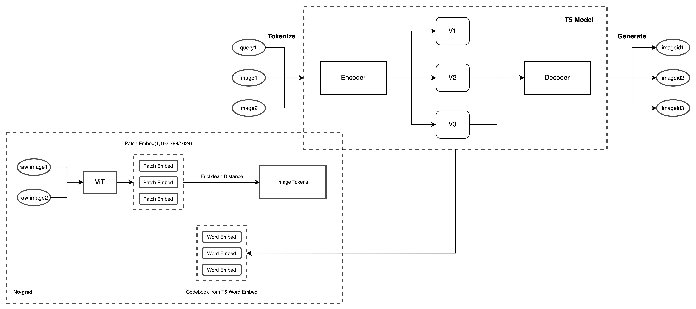
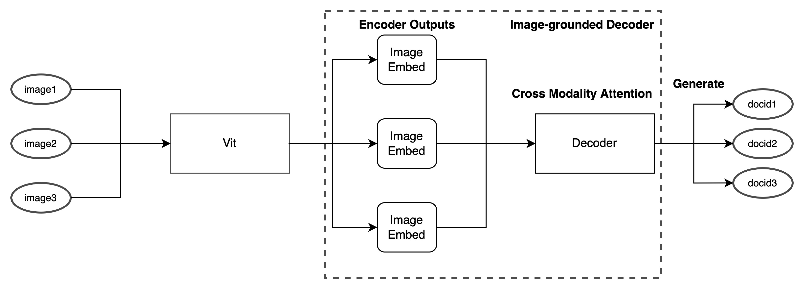

# Text-To-Image Retrieval
## My Thoughts
- To leverage the DSI generative index strategy, I treat Text-To-Image Retrieval as a two-step task
  - Image Caption
  - DSI(Indexing&Retrieval)
- In DSI settings, there are 3 main tasks and let's see their counterparts in Text-To-Image Retrieval
  - Indexing Strategy(can directly leverage same strategy)
  - DocId Representation --- ImageId Representation(can directly leverage same strategy)
  - **Doc Representation --- Image Representation(Cross Modality!)**
- Hence, the key task is to do image representation and make it align with the text. Here I come up with two naive solutions
  1. CodeBook: Did a simple workaround to use almost the same training structure as DSI(Training and Inference are the same)
    - Treat Image as Visual Tokens, and use codebook directly from T5 pretrained word embeddings to find the closest visual token
    - This is done in a no-grad manner, so the codebook is not updated during training
    - This could be(probably should be) done better by pretraining this image captioning/tokenization task, and both image embeddings and codebook should be linear projected(project to the same space) and then caculate the distance
      
      Similar ideas are already used in [Language Quantized AutoEncoders: Towards Unsupervised Text-Image Alignment](https://arxiv.org/abs/2302.00902)
      and [Linearly Mapping from Image to Text Space](https://arxiv.org/abs/2209.15162)
      
        
  ---
  2. Cross Modality Attention: Use a different multi-modal interaction method(image-grounded decoder), and it changes from DSI's co-training to a two-step training
     - Indexing: image-to-text(id)
     - Retrieval: text-to-text(id) same as DSI
       This is done by leverage the encoder-decoder architecture of T5, and use the vit encoder to encode the image, and use the vit encoder embedding to serve as Key-Value pairs for the T5 decoder to generate the text(id)
     
     Similar ideas are already used in [BLIP](https://arxiv.org/abs/2201.12086)
     
       Image-To-Text(Indexing) Training:
     
       Training:
       - Input: Image Embedding from ViT
       - Output: Image Id from T5
     
       Inference:
       - Input: Image Embedding from ViT
       - Output: Image Id from T5

## Overview
Codebook Overview



Cross Modality Attention



## Code

- Dataset: `flickr30k_data.py`
- Training: `train_i2m.py`
- Model: `trainer.py`


### Step1: Create NQ10K training (indexing) and validation datasets

```
cd data/NQ
python3 create_NQ_train_vali.py
```

### Step2: Run training script
cd back to the root directory and run:

```
python3 train.py
```
The training can be run with a single Tesla-v100 32G GPU. We use [wandb](https://wandb.ai/site) to log the Hits scores during training:


